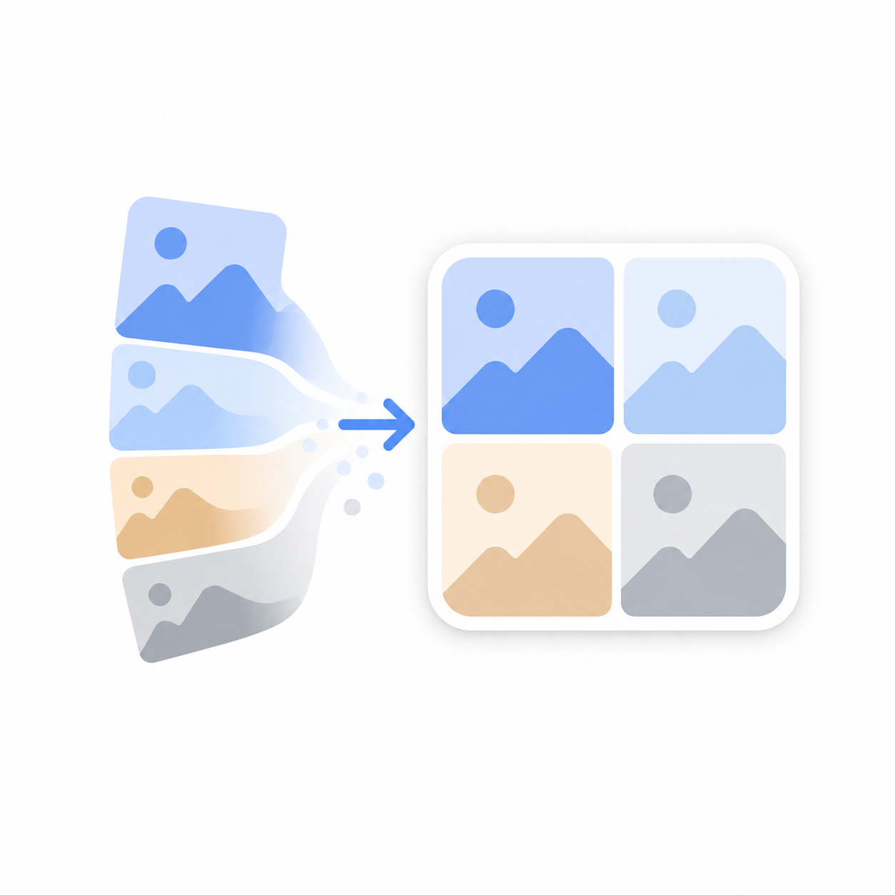

<p align="center">
  
</p>

<h1 align="center">PicMeld</h1>

<p align="center">
  <strong>Batch photo collage — merge up to 200 photos into 2x2 grids</strong><br>
  Lightweight, offline, zero permissions beyond storage
</p>

<p align="center">
  <a href="README_zh-CN.md">简体中文</a> · <a href="README_zh-TW.md">繁體中文</a>
</p>

---

## Features

- **Batch processing** — select up to 200 photos, automatically grouped into 2x2 grid collages
- **Smart scaling** — images are proportionally scaled to fit without cropping; white fills gaps
- **EXIF correction** — auto-rotates photos based on EXIF orientation metadata
- **Append mode** — add photos in multiple batches without duplicates
- **Live progress** — real-time progress bar with count and percentage
- **Fully offline** — no network calls, no analytics, no tracking
- **Gallery export** — output saved directly to system gallery as JPG

## Requirements

- Android 8.0 (API 26) or higher
- Storage permission only on Android 9 and below (auto-granted on Android 10+)

## Architecture

```
com.ha1baraa11.picmeld/
├── MainActivity.kt      # UI layer — photo picker, RecyclerView, progress overlay
├── MainViewModel.kt     # State management — selected URIs, progress, errors
├── ImageProcessor.kt    # Core engine — bitmap scaling, EXIF fix, Canvas compositing
└── PhotoAdapter.kt      # RecyclerView adapter — thumbnail grid with delete buttons
```

**Stack:** Kotlin · MVVM · ViewBinding · Coroutines · Material 3

## How It Works

1. Tap **Select Photos** to pick images from your gallery (multi-select supported)
2. Preview the 3-column thumbnail grid; tap any image to remove it
3. Tap **Generate** — the app groups every 4 photos into one 2x2 collage
4. Output JPGs are saved to `Pictures/PicMeld/` in your system gallery

## Build

```bash
git clone https://github.com/Ha1baraA11/PicMeld.git
cd PicMeld
./gradlew assembleDebug
```

APK output: `app/build/outputs/apk/debug/app-debug.apk`

## License

MIT
